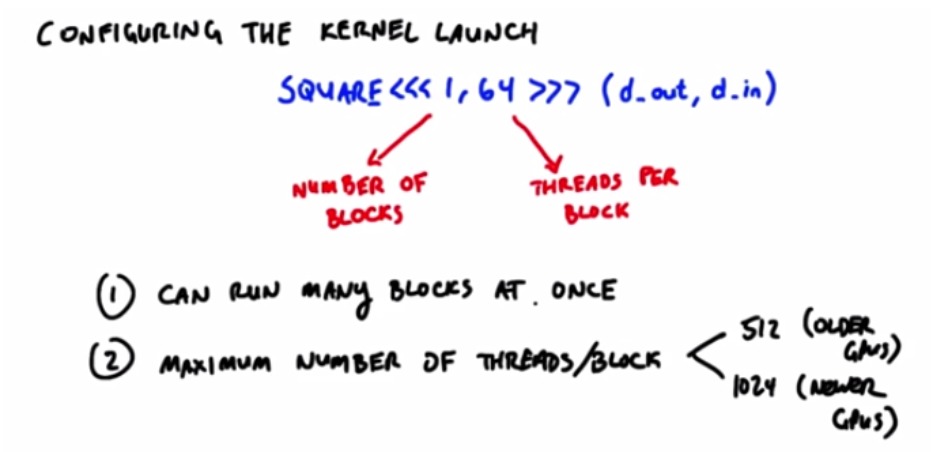

# Lesson 1

## Kernel?


## Latency vs. Bandwith

Latency: time, second

Bandwidth: stuff/time, jobs/hour

## Core GPU design tenets

1. Lots of simple compute units.  Trade simple control for more compute
2. Explicitly parallel programming model
3. Optimize for throughput not latency

## GPUs from the point of view of the software developer

Importance of programming in parallel

## CUDA program diagram


1. Moving data from the CPU's memory to the GPU's memory.

2. moving data from the GPU back to the CPU.

   ```c
   cudaMemcpy
   ```

3. allocating memory on the GPU, and in C this command is Malloc, so in CUDA, it's 

   ```c
   cudaMalloc
   ```

4. invoking programs on the GPU that compute things in parallel.  These programs are called kernels. We say that the host launches kernels on the device.

## A CUDA program

A typical GPU program looks like this:

1. CPU allocates storage on GPU. `cudaMalloc`  
2. CPU copies input data from cpu -> GPU `cudaMemcpy`
3. CPU launches kernels on GPU to process the data `kernel launch`
4. CPU copies results back to CPU from GPU `cudaMemcpy`

## Defining the GPU Computation

Now allocating and transferring memory is pretty straight forward. The interesting part of GPU computing is defining the computation that actually happens on the GPU.

We structure that computation as a series of one or more kernels. Now as we said earlier, the GPU has lots of parallel computation units. When you write kernels, those kernels need to take advantage of that hardware parallelism.

So how do they do that? And here is the big idea.  It is one of the very core concepts of CUDA.

Kernels look like serial programs.  Write your program as if it will run on **one** thread.  The GPU will run that program on **many** threads. When you call the kernel from the CPU, you tell it how many threads to launch, and each of those threads will run this kernel.

## What is GPU good at?

1. Efficiently launching lots of threads
2. Running lots of threads in parallel.

### Squaring A Number on the CPU

```c++
for (i = 0; i < 64; ++i) {
	out[i] = in[i] * in[i];
}
```

### GPU code: a high-level view


cpu code: 

```c
suqreKernel <<<64>>> (outArray, inArray)
```


### Squaring Numbers using CUDA 

```c
#include <stdio.h>

__global__ void cube(float * d_out, float * d_in){
	// Todo: Fill in this function
    int idx = threadeIdx.x;
    float f = d_in[idx];
    d_out[idx] = f * f * f;
}

int main(int argc, char ** argv) {
	const int ARRAY_SIZE = 64;
	const int ARRAY_BYTES = ARRAY_SIZE * sizeof(float);

	// generate the input array on the host
	float h_in[ARRAY_SIZE];
	for (int i = 0; i < ARRAY_SIZE; i++) {
		h_in[i] = float(i);
	}
	float h_out[ARRAY_SIZE];

	// declare GPU memory pointers
	float * d_in;
	float * d_out;

	// allocate GPU memory
	cudaMalloc((void**) &d_in, ARRAY_BYTES);
	cudaMalloc((void**) &d_out, ARRAY_BYTES);

	// transfer the array to the GPU
	cudaMemcpy(d_in, h_in, ARRAY_BYTES, cudaMemcpyHostToDevice);

	// launch the kernel
	cube<<<1, ARRAY_SIZE>>>(d_out, d_in);

	// copy back the result array to the CPU
	cudaMemcpy(h_out, d_out, ARRAY_BYTES, cudaMemcpyDeviceToHost);

	// print out the resulting array
	for (int i =0; i < ARRAY_SIZE; i++) {
		printf("%f", h_out[i]);
		printf(((i % 4) != 3) ? "\t" : "\n");
	}

	cudaFree(d_in);
	cudaFree(d_out);

	return 0;
}
```

## Configuring the Kernel Launch Parameters




## Map

Set of elements to process: 64 floats

Function to run on each element: "square"

```c
map(elements, function)
```

GPUs are good at map:

1. GPUs have many parallel processors
2. GPUs optimize for throughput


## Lesson 1 Summary

1. Technology trends
2. Throughput vs latency
3. GPU design goals
4. GPU programming model
5. Map

## Problem set 1: Convert image to grayscale